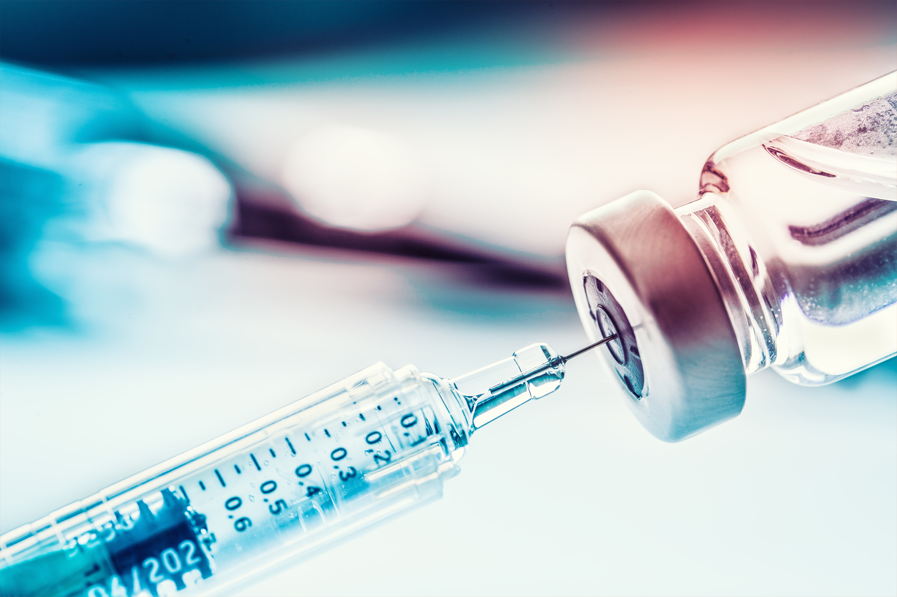
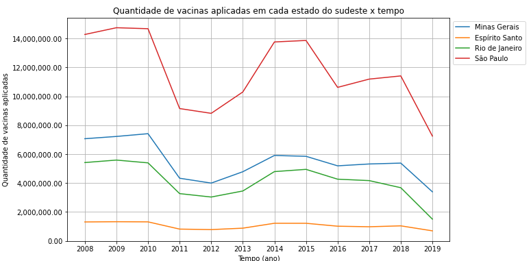
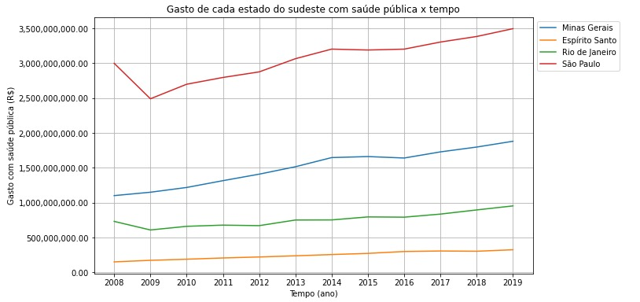
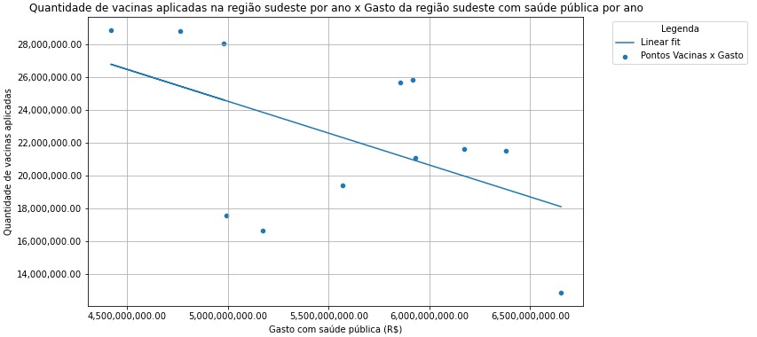

# Projeto sobre Análise da vacinação da região Sudeste do Brasil.
Projeto para análise de dados abertos da saúde do Brasil(SUS) com enfoque na região sudeste.

   

# Objetivo:
O objetivo deste projeto é analisar os dados públicos da saúde se utilizando de métodos de tratamentos de dados e vizualização gráfica utilizando os dados de Doses de vacina aplicadas por Unidade da Federação por ano.

Vale ser ressaltado que a base de dados utilizada continha o número total de doses de vacinas aplicadas, assim, não especificando grupos sociais ou prioritários nos focos das campanhas, tornando a análise menos contextualizada.

# Sobre o projeto:

O projeto está estruturado da seguinte forma:

 . Importação das bibliotecas
 
 . Carregamento das bases
 
 . Limpeza e tratamento das bases
   
    -Explicação de todo tratamento feito e porque.
 
 . Criação de vizualizações
 
 . Discussões
 
 # Hipótese inicial:
 
 A hipótese inicial era a de que conforme crescesse o investimento em saúde pública, maior iriam ser os números relacionados à vacinação.

# Resultados:

   
  
   

# Discussão:

Análise do gráfico de vacinação:
    
- Observamos 3 grandes picos no gráfico, e segundo informações da fiocruz :https://radis.ensp.fiocruz.br/index.php/home/reportagem/linha-do-tempo-vacinacao-no-brasil, podemos explicar o pico do ano de 2008 pelo início da campanha de vacinação contra rubéola, que tinha como intuito erradicar a doença das américas até o ano de 2010(http://bvsms.saude.gov.br/bvs/publicacoes/campanha_nacional_vacinacao_rubeola_p1.pdf).
    
- O segundo pico pode ser explicado pela adição de 3 vacinas ao programa de vacinação: a vacina contra hepatite A para crianças (15 meses de idade); contra o HPV (Papiloma vírus humano), para meninas de 9 a 13 anos; e dTpa (tétano, difteria e coqueluche acelular) para gestantes.
    
 - O terceiro, porém menor, pico em 2018 pode ser explicado pelo aumento do público que poderia receber a vacina contra HPV.
    
 - Observamos um padrão desregular no gráfico e que intuitivamente nos leva a crer que em média a quantidade de vacinação no sudeste está diminuindo com o passar dos anos.
    
Sobre o terceiro gráfico:

 - O coeficiente angular do linear fit foi -0.0039 e o coeficiente linear foi 43979496 .

Para complementar a análise eu queria fazer um gráfico da quantidade de vacinas x gasto com saúde pública da região sudeste como um todo, assim, eu plotei   os pontos gerados cruzando essas duas variáveis e fiz um "fit linear" desses pontos, ou seja, uma regressão linear, que é um método para criar a melhor reta que descreva o comportamento dos pontos apresentados, assim, o método chega nos melhores valores para o coeficiente angular da reta( o coeficiente que dá a inclinação da reta) e para o coeficiente linear da reta( o ponto em x onde a reta cruza o valor y=0) e plota um gráfico utilizando esses coeficientes e os valores de x fornecidos (aqui, os valores de gasto ).

As primeiras conclusões que podemos obter deste gráfico são:

- Observamos que quanto maior o investimento com saúde pública mais baixo a quantidade de vacinas aplicadas na região sudeste. Como sabemos que ambas as quantidades estão ordenados pelo passar do anos, temos implicitamente que com o passar dos anos o gasto com saúde pública vem aumentando enquanto a média do número de vacinas aplicadas vem diminuindo, resultado que é refletido nos gráficos anteriores por analisarem os mesmos índices.

- Por conta do coeficiente angular ser muito baixo temos que a variação no eixo x é muito maior que a variação do eixo y, assim, podemos levantar a hipótese que o investimento em saúde na região Sudeste vem crescendo muito mais do que a média de vacinas aplicas na região vem diminuindo.

# Limitações do projeto:

- A falta de bases de dados afins no site do datasus limitou o escopo de comparações deste análise, por exemplo, uma ideia inicial foi comparar os dados de campanhas de vacinação em outros períodos temporais com a campanha de vacinação atual contra o COVID-19, contudo, a base de dados pública sobre a vacinação contra o COVID-19 possuia 35 GB e iria demorar dias para baixar, inviabilizando essa análise, assim, chamando a atenção para a melhor gestão desses dados. 

- Além disso, o datasus só nos fornecia as quantidades totais de vacinação por Unidade federativa por ano e a quantidade total de vacinas contra cada infermidade tratada pelo programa ao longo de todos os anos avaliados, assim, essa segunda base de dados que não contava com o índice temporal não era muito útil para as análises pretendidas nesse trabalho.

- A última análise feita nesse projeto foi uma análise totalmente simples, primeiramente, imaginamos que diversas variáveis governam o compartamento da curva de vacinações, não somente o investimento público em saúde, por exemplo, temos as durações das diferentes campanhas de vacinação e até as emergências de saúde de cada estado da região e vários outros pormenores. Tendo isso em vista, um comportamento linear entre as duas quantidades não era algo intuitivamente esperado, logo, a regressão linear foi apenas um primeiro passo em uma análise correlacional entre as duas quantidades, que no final das contas podem nem estar relacionadas, contrariando nossa intuição.

# Ideias para projetos vindouros:

- Como previamente citado, uma análise correlacional entre as quantidades gasto com saúde pública e quantidade de vacinas aplicadas é bem vinda, assim como uma modelagem mais minuciosa, usando outros tipos de função menos simplórias do que uma função linear.

- Se disponibilizada uma base de dados da campanha de vacinação contra o COVID-19  ou outras bases que contenham informações adicionais uma nova análise com métodos estatísticos mais refinados seria um bom escopo de projeto.

# Bases:

- vacinas = Conjunto de dados que possui os dados de quantidade de vacinas aplicas por Unidade Federativa por ano.
- gastos = Conjunto de dados que pussui as informações de gastos com saúde pública pelo governo por Unidade Federativa por ano.

# Contato:

-Linkedin : https://www.linkedin.com/in/lucas-fran%C3%A7a-83133016b/

-Email : lucas.c.franca@gmail.com

# Fontes:

- Dados sobre vacinação: http://tabnet.datasus.gov.br/cgi/tabcgi.exe?pni/cnv/cpniuf.def
- Dados sobre os gastos: http://tabnet.datasus.gov.br/cgi/deftohtm.exe?sih/cnv/qiuf.def
- Informação sobre campanhas de vacinação: https://radis.ensp.fiocruz.br/index.php/home/reportagem/linha-do-tempo-vacinacao-no-brasil
- Informação sobre a campanha da Rubéola: http://bvsms.saude.gov.br/bvs/publicacoes/campanha_nacional_vacinacao_rubeola_p1.pdf

